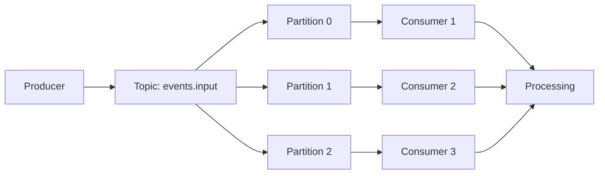

# Kafka Consumer Architecture Documentation

## 1. Overview
This document explains the architecture and configuration of our Kafka consumer implementation for the schema validation pipeline.

## 2. Components

### 2.1 Topic Structure
- **Topic Name**: `events.input`
- **Partitions**: 3 (events.input-0, events.input-1, events.input-2)
- **Purpose**: Receives events for schema validation

### 2.2 Consumer Group Configuration
```yaml
spring:
  kafka:
    consumer:
      group-id: schema-pipeline-group
      auto-offset-reset: earliest
      enable-auto-commit: false
```

#### Key Features:
- **Consumer Group ID**: `schema-pipeline-group`
  - Groups consumers for parallel processing
  - Enables load balancing across consumers
  - Provides fault tolerance

- **Offset Management**:
  - `auto-offset-reset: earliest`
    - Starts reading from beginning when no offset is committed
    - Ensures no messages are missed on initial deployment
  - `enable-auto-commit: false`
    - Manual offset commitment
    - Prevents message loss during processing

### 2.3 Listener Configuration
```yaml
listener:
  ack-mode: MANUAL_IMMEDIATE
  concurrency: 3
  type: SINGLE
  missing-topics-fatal: false
```

#### Configuration Details:
- **Concurrency**: 3 consumer instances
- **Processing Type**: Single record processing
- **Acknowledgment**: Manual, immediate
- **Topic Handling**: Tolerant of missing topics

## 3. Internal Working

### 3.1 Consumer Startup Process
1. Application initialization
   - Creates 3 consumer instances
   - Each consumer registers with consumer group
   - Kafka broker manages partition assignment

2. Partition Assignment Formula:
   ```
   If (partitions >= consumers):
      min_partitions_per_consumer = floor(total_partitions / total_consumers)
   If (partitions < consumers):
      some_consumers = idle
   ```

### 3.2 Message Flow


### 3.3 Consumer Health Management
```yaml
consumer:
  properties:
    session.timeout.ms: 45000
    heartbeat.interval.ms: 10000
```

- **Health Monitoring**:
  - Heartbeat Interval: 10 seconds
  - Session Timeout: 45 seconds
  - Maximum Poll Interval: 300 seconds

### 3.4 Fault Tolerance
1. **Consumer Failure Detection**
   - Missing heartbeats trigger failure detection
   - Session timeout determines failure confirmation

2. **Rebalancing Process**
   - Triggered on consumer failure/addition
   - Redistributes partitions among available consumers
   - Ensures continuous processing

## 4. Message Processing

### 4.1 Consumer Implementation
```java
@KafkaListener(
    topics = "${topics.input}",
    containerFactory = "kafkaListenerContainerFactory",
    concurrency = "${kafka.listener.concurrency:3}"
)
public void listen(ConsumerRecord<String, String> record, 
                  Acknowledgment ack) {
    // Process message
    ack.acknowledge();
}
```

### 4.2 Processing Guarantees
- **Message Ordering**: Maintained within each partition
- **Processing Semantics**: At-least-once with manual commits
- **Failure Handling**: Automatic partition rebalancing

## 5. Monitoring Considerations

### 5.1 Key Metrics
- Consumer lag
- Processing time
- Rebalance frequency
- Error rates

### 5.2 Health Indicators
- Consumer group membership
- Partition assignment status
- Offset commit success rate

## 6. Scaling Considerations

### 6.1 Horizontal Scaling
- Add partitions to increase parallelism
- Adjust consumer count based on load
- Monitor partition/consumer ratio

### 6.2 Performance Tuning
- Batch size configuration
- Poll interval adjustment
- Memory allocation per consumer

## 7. Troubleshooting

### 7.1 Common Issues
1. Consumer group rebalancing
2. Message processing delays
3. Offset commitment failures

### 7.2 Resolution Steps
1. Monitor consumer group health
2. Check consumer logs for errors
3. Verify network connectivity
4. Validate message format

This documentation provides a comprehensive overview of our Kafka consumer implementation. For specific implementation details or configuration changes, refer to the application code and configuration files.
